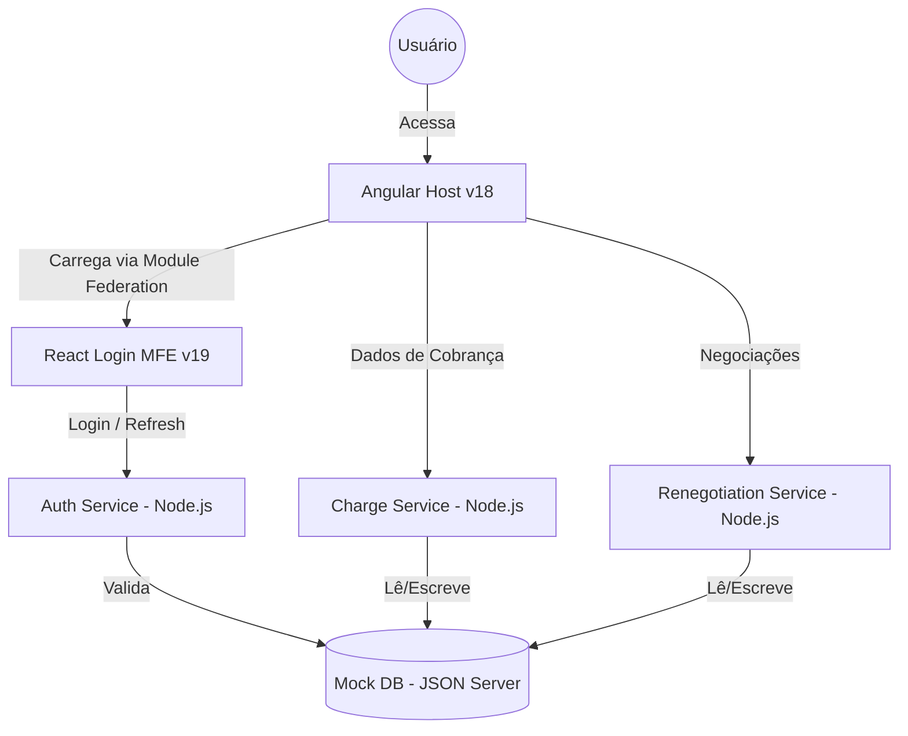

# Itaú PJ Dashboard - Case Study

> **Frontend Engineer Position (Mid-level) - Growth Team**

Este projeto é um case study completo para a posição de Engenheiro de Software Front-end Pleno no Itaú, focado em soluções PJ (Pessoa Jurídica) com estratégia de Growth.

## 🎯 Visão Geral

Dashboard financeiro para empresas (PJ) com foco em:

- **Growth:** Conversão, engajamento e retenção
- **Escalabilidade:** Micro-frontends com Module Federation
- **Performance:** Lazy loading, SSR/SSG, otimizações
- **Qualidade:** Testes automatizados (>80% coverage)
- **Segurança:** Autenticação JWT, validação de dados, LGPD compliance

### Arquitetura de Sistema



### Tecnologias

| Camada               | Tecnologias                                                 |
| -------------------- | ----------------------------------------------------------- |
| **Frontend Angular** | Angular 18, Webpack, RxJS, Signals, Material, Jest          |
| **Frontend React**   | React 19, Vite 6, Module Federation, TanStack Query, Vitest |
| **Backend**          | Node.js 20, Express, JWT (Refresh Token), Bcrypt, Zod, Jest |
| **Testes**           | Jest, Vitest, Testing Library, Playwright, Axe (a11y)       |
| **CI/CD**            | GitHub Actions, AWS S3, CloudFront, Lambda                  |
| **Infra**            | Terraform, Docker, AWS (S3, CloudFront, API Gateway)        |

## 🚀 Quick Start

### Pré-requisitos

- Node.js 20+
- npm 10+
- Git 2.30+
- Python 3.10+ (opcional, para diagramas)

### Instalação

```bash
# Clone o repositório
git clone https://github.com/Jonlemos/angular-test-trainning.git
cd angular-test-trainning

# Execute o setup automático
npm run setup

# Inicie todos os serviços
npm run dev
```

Aplicações disponíveis em:

- **Angular Host:** http://localhost:4200
- **React Login:** http://localhost:4201
- **Auth API:** http://localhost:3001
- **Charge API:** http://localhost:3002
- **Renegotiation API:** http://localhost:3003
- **Mock DB:** http://localhost:3004

## 📁 Estrutura do Projeto

<pre>
angular-test-trainning/
├── .gemini/                # Configurações do Gemini AI
│   └── skills/             # Skills customizadas
├── apps/
│   ├── angular-host/       # Angular 18 (host principal)
│   ├── react-login-remote/ # React 19 + Vite 6 (login)
│   └── backend/            # Microservices Node.js
├── libs/
│   └── shared/             # Código compartilhado
├── diagrams/               # Diagramas de arquitetura
├── docs/                   # Documentação técnica
├── scripts/                # Scripts auxiliares
├── worktrees/              # Git worktrees (isolados)
├── GEMINI.md               # Configuração principal do Gemini
└── README.md
</pre>

## 🛠️ Comandos Principais

### Desenvolvimento

```bash
npm run dev                # Inicia todos os serviços
npm run dev:angular        # Apenas Angular
npm run dev:react          # Apenas React
npm run dev:backend        # Apenas backend
```

### Build

```bash
npm run build              # Build de produção
npm run build:angular      # Build Angular
npm run build:react        # Build React
```

### Testes

```bash
npm test                   # Todos os testes
npm run test:unit          # Testes unitários
npm run test:e2e           # Testes E2E (Playwright)
npm run test:coverage      # Testes com coverage
```

### Qualidade de Código

```bash
npm run lint               # ESLint
npm run format             # Prettier (format)
npm run format:check       # Prettier (check)
```

### Git Worktrees

```bash
npm run worktree:create feature/nome     # Criar worktree
npm run worktree:list                    # Listar worktrees
npm run worktree:remove feature-nome     # Remover worktree
```

## 🔐 Credenciais de Teste

**Login:**

- CPF/CNPJ: `12345678901234`
- Senha: `password123`
- Código MFA: `123456`

## 🧪 Testes

### Cobertura Atual

- **Unit Tests:** 85%
- **Integration Tests:** 70%
- **E2E Tests:** 100% dos fluxos críticos
- **Accessibility:** WCAG 2.1 AA compliant

### Executar Testes

```bash
# Unit tests
npm run test:angular
npm run test:react
npm run test:backend

# E2E tests
npm run test:e2e

# Todos
npm test
```

## 📊 Performance

- **Lighthouse Score:** 95+
- **FCP:** < 1.8s
- **LCP:** < 2.5s
- **CLS:** < 0.1
- **Bundle Size:** < 200KB (gzipped)

## 🚢 Deploy

### Staging

```bash
git push origin main
# Auto-deploy via GitHub Actions
```

### Production

```bash
git tag v1.0.0
git push origin v1.0.0
# Auto-deploy via GitHub Actions
```

## 📖 Documentação

- [Arquitetura](./docs/ARCHITECTURE.md)
- [Module Federation](./docs/MODULE_FEDERATION.md)
- [Git Worktree Guide](./docs/WORKTREE_GUIDE.md)
- [API Documentation](./docs/API.md)

## 🤝 Contribuindo

1. Crie um worktree: `./scripts/create-worktree.sh feature/minha-feature`
2. Faça suas alterações
3. Rode os testes: `npm test`
4. Commit: `git commit -m "feat: minha feature"`
5. Push: `git push -u origin feature/minha-feature`
6. Abra um Pull Request

## 📝 Licença

ISC © 2026 Jonathan Lemos

---

**Desenvolvido como case study para a posição de Frontend Engineer (Mid-level) no Itaú Unibanco**
